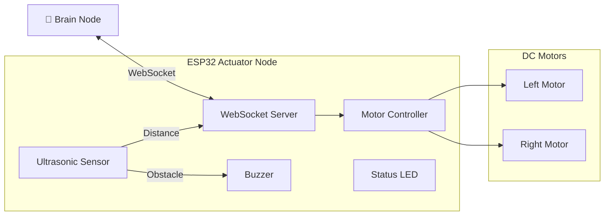

# ⚙️ Actuator Node (main.cpp)

> ESP32-Based Motor Controller and Safety System

## Overview

The Actuator Node is the low-level hardware abstraction layer (HAL) running on an ESP32 microcontroller. It handles motor control, obstacle detection, and safety enforcement via an asynchronous WebSocket server.

---

## 🏗️ System Architecture



---

## 📋 Requirements

### Hardware
- ESP32 DevKit or compatible board
- L298N Motor Driver (or similar H-Bridge)
- HC-SR04 Ultrasonic Sensor
- 2x DC Motors (6-12V)
- Buzzer (5V active)
- LED (status indicator)

### Software
- PlatformIO or Arduino IDE
- Required Libraries:
  - `ArduinoJson`
  - `AsyncTCP`
  - `ESPAsyncWebServer`

---

## 🔌 Pin Configuration

| Component | GPIO Pin | Description |
|-----------|----------|-------------|
| Left Motor Forward | 4 | L298N IN1 |
| Left Motor Backward | 2 | L298N IN2 |
| Left Motor PWM | 14 | L298N ENA (speed) |
| Right Motor Forward | 32 | L298N IN3 |
| Right Motor Backward | 33 | L298N IN4 |
| Right Motor PWM | 27 | L298N ENB (speed) |
| Ultrasonic Trigger | 5 | HC-SR04 TRIG |
| Ultrasonic Echo | 34 | HC-SR04 ECHO |
| Buzzer | 12 | Active buzzer |
| Status LED | 13 | Connection indicator |

### Wiring Diagram

```
ESP32                   L298N
─────                   ─────
GPIO 4  ────────────►  IN1 (Left Fwd)
GPIO 2  ────────────►  IN2 (Left Bwd)
GPIO 14 ────────────►  ENA (Left PWM)
GPIO 32 ────────────►  IN3 (Right Fwd)
GPIO 33 ────────────►  IN4 (Right Bwd)
GPIO 27 ────────────►  ENB (Right PWM)
GND     ────────────►  GND
5V      ────────────►  +5V (Logic)

ESP32                   HC-SR04
─────                   ───────
GPIO 5  ────────────►  TRIG
GPIO 34 ◄────────────  ECHO
5V      ────────────►  VCC
GND     ────────────►  GND
```

---

## 📡 Network Configuration

| Setting | Value |
|---------|-------|
| Static IP | `172.20.11.118` |
| Gateway | `172.20.11.1` |
| Subnet | `255.255.255.0` |
| WiFi SSID | `Fawstech R&D` |
| WebSocket Path | `/ws` |

---

## 📨 Communication Protocol

### Command Format (JSON over WebSocket)

#### 1. Heartbeat (Keep-Alive)
```json
{"cmd": "H"}
```
Must be received every **1.5 seconds** or motors will stop.

#### 2. Differential Drive (PID Mode)
```json
{
  "cmd": "M",
  "left_dir": "F",    // "F" (forward) or "B" (backward)
  "left_spd": 150,    // 0-255
  "right_dir": "F",
  "right_spd": 120
}
```

#### 3. Simple Move (Legacy Mode)
```json
{
  "cmd": "M",
  "dir": "F",   // "F"=Forward, "B"=Back, "L"=Left, "R"=Right, "S"=Stop
  "spd": 150   // 0-255
}
```

### Response Format (Sensor Feedback)
Distance readings sent to Brain Node every **100ms**:
```json
{"dist": 45.5}
```

---

## 🛡️ Safety Features

### 1. Obstacle Detection
- **Stop Distance:** 25 cm
- Buzzer activates when obstacle detected
- Forward motion blocked automatically

### 2. Heartbeat Timeout
- **Timeout:** 1.5 seconds
- Motors stop if no heartbeat received
- LED turns OFF to indicate lost connection

### 3. Connection Indicator
| LED State | Meaning |
|-----------|---------|
| ON (Solid) | Brain Node connected |
| OFF | Disconnected / Heartbeat lost |

---

## 🚀 Uploading Firmware

### Using PlatformIO
```bash
cd actuator_node
pio run --target upload
```

### Using Arduino IDE
1. Open `src/main.cpp`
2. Install required libraries
3. Select ESP32 Dev Module
4. Upload

### platformio.ini Configuration
```ini
[env:esp32dev]
platform = espressif32
board = esp32dev
framework = arduino
lib_deps = 
    bblanchon/ArduinoJson@^6.21.0
    me-no-dev/AsyncTCP
    me-no-dev/ESPAsyncWebServer
monitor_speed = 115200
```

---

## 📊 Serial Monitor Output

```
Connecting to WiFi.....
✅ ACTUATOR HAL v5.0 ONLINE
📡 IP Address: 172.20.11.118
🤖 Support: Simple & Differential Drive
Brain Linked: Client #1
DIFF: L=F150 R=F120
```

---

## 🔧 Motor Control Logic

### Differential Drive
Independent speed/direction for each wheel enables:
- Pure forward/backward motion
- Spot turns (pivot in place)
- Curved paths (PID steering)

### Speed Values
| Value | Meaning |
|-------|---------|
| 0 | Stopped |
| 100-150 | Normal navigation |
| 200-255 | Kickstart (overcome stiction) |

---

## 🔧 Troubleshooting

| Issue | Cause | Solution |
|-------|-------|----------|
| Motors not spinning | Wrong pins | Verify GPIO connections |
| Jerky movement | PWM too low | Increase minimum speed |
| Constant stopping | Obstacle false positive | Check ultrasonic sensor |
| Brain can't connect | Wrong IP | Verify static IP config |
| LED always OFF | No heartbeat | Check Brain Node running |

---

## 📂 Project Structure

```
actuator_node/
├── src/
│   └── main.cpp          # Main firmware
├── platformio.ini        # Build configuration
└── README.md             # This file
```

---

*Version: ACTUATOR HAL v5.0*
