# 🧠 Brain Node (main.py)

> Central AI Controller for the Autonomous Smart Wheelchair System

## Overview

The Brain Node is the high-level Python-based controller that coordinates visual perception, voice interaction, and real-time navigation. It implements a deterministic **state-machine architecture** for autonomous indoor navigation using ArUco marker-based localization.

---

## 🏗️ System Architecture

```mermaid
flowchart TB
    subgraph Brain["🧠 Brain Node (Python)"]
        SM[State Machine]
        PID[PID Controller]
        PE[Pose Estimator]
        VI[Voice Interface]
    end
    
    subgraph Vision["📷 Vision Node"]
        CAM[Camera Stream]
    end
    
    subgraph Actuator["⚙️ Actuator Node"]
        MOT[Motor Controller]
        USS[Ultrasonic Sensor]
    end
    
    CAM -->|MJPEG Stream| Brain
    Brain -->|WebSocket Commands| MOT
    USS -->|Distance Feedback| Brain
    VI <-->|Voice I/O| SM
```



---

## 📋 Requirements

### Hardware
- Windows PC or Raspberry Pi with Python 3.8+
- Microphone (for voice commands)
- Speaker (for voice feedback)

### Python Dependencies
```bash
pip install opencv-python numpy websocket-client pyttsx3 SpeechRecognition
```

### Network Configuration
| Node | IP Address | Port |
|------|------------|------|
| Vision Node | `172.20.11.126` | HTTP 80 |
| Actuator Node | `172.20.11.118` | WebSocket `/ws` |

---

## 🔄 State Machine

The navigator follows a 6-state architecture:

| State | Description | Transitions To |
|-------|-------------|----------------|
| `IDLE` | Waiting for voice/keyboard command | SCAN |
| `SCAN` | Rotating to find target ArUco marker | ALIGN |
| `ALIGN` | Centering marker using 3D bearing | APPROACH |
| `APPROACH` | Moving forward with PID correction | ARRIVED |
| `ARRIVED` | Reached destination, check waypoints | IDLE/SCAN |
| `MANUAL` | User keyboard control mode | IDLE |


---

## 🗺️ Navigation System

### Location IDs (ArUco Markers)
| Location | ArUco ID |
|----------|----------|
| Hazard | 0 |
| Bedroom | 3 |
| Bathroom | 5 |
| Hallway | 6 |
| Living Room | 7 |
| Kitchen | 9 |

### Path Planning
The system uses **BFS (Breadth-First Search)** on a navigation graph:

```
HALLWAY ← → BEDROOM
   ↓
   ← → LIVING_ROOM ← → KITCHEN
   ↓
BATHROOM
```

---

## 🚀 Running the Node

```bash
cd brain_node
python main.py
```

### Keyboard Controls

| Key | Action |
|-----|--------|
| `K` | Navigate to Kitchen |
| `B` | Navigate to Bedroom |
| `H` | Navigate to Hallway |
| `L` | Navigate to Living Room |
| `T` | Navigate to Bathroom |
| `M` | Toggle Manual Mode |
| `Q` | Quit |

### Manual Mode (when `M` is active)
| Key | Action |
|-----|--------|
| `W` | Forward |
| `S` | Backward |
| `A` | Rotate Left |
| `D` | Rotate Right |
| `Space` | Stop |

### Voice Commands
- *"Go to kitchen"*
- *"Take me to bedroom"*
- *"Stop"*

---

## ⚙️ Configuration Parameters

| Parameter | Default | Description |
|-----------|---------|-------------|
| `X_CENTER` | 160 | Frame horizontal center (px) |
| `STEER_DEADZONE` | 35 | Steering tolerance (px) |
| `STOP_AREA` | 12000 | Stop when marker area exceeds |
| `SPD_MAX_AUTO` | 140 | Maximum autonomous speed |
| `SPD_SEARCH` | 120 | Scanning rotation speed |
| `SPD_ALIGN` | 100 | Alignment rotation speed |

### PID Tuning
| Gain | Value | Purpose |
|------|-------|---------|
| KP | 0.5 | Proportional response |
| KI | 0.02 | Integral (drift correction) |
| KD | 0.1 | Derivative (damping) |

---

## 📡 Communication Protocol

### Motor Commands (WebSocket JSON)

**Differential Drive:**
```json
{
  "cmd": "M",
  "left_dir": "F",
  "left_spd": 150,
  "right_dir": "F", 
  "right_spd": 120
}
```

**Heartbeat (sent every 100ms):**
```json
{"cmd": "H"}
```

### Sensor Feedback (from Actuator)
```json
{"dist": 45.5}
```

---

## 🛡️ Safety Features

1. **Hazard Detection** - Emergency stop on ArUco ID 0
2. **Video Watchdog** - Stops if no frame for 3 seconds
3. **Heartbeat Monitoring** - Maintains connection to actuator
4. **Obstacle Avoidance** - Respects ultrasonic distance feedback

---

## 📊 Debug Output

The terminal displays color-coded logs:

| Color | Level | Example |
|-------|-------|---------|
| 🟦 Blue | INFO | `👂 Heard: kitchen` |
| 🟩 Green | SUCCESS | `🏁 MISSION COMPLETE` |
| 🟨 Yellow | WARNING | `⚠️ Target Lost` |
| 🟥 Red | ERROR | `Motor send failed` |
| 🟪 Purple | STATE | `SCAN -> ALIGN` |

---

## 📂 Related Files

| File | Purpose |
|------|---------|
| `main.py` | Primary navigation controller |
| `main_v2.py` | Development/testing variant |
| `default_map.json` | Navigation graph data |

---

## 🔧 Troubleshooting

| Issue | Solution |
|-------|----------|
| `WinError 10054` | Actuator disconnected - check WiFi |
| No markers detected | Verify camera IP, lighting conditions |
| Motors not responding | Check heartbeat connection |
| Voice not working | Ensure microphone permissions |

---

*Version: AI Navigator v7.0*
