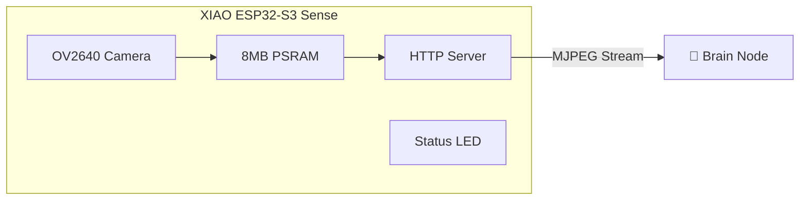

# 📷 Vision Node (main.cpp)

> ESP32-S3 Camera Module for Real-Time Video Streaming

## Overview

The Vision Node provides real-time MJPEG video streaming from a Seeed XIAO ESP32-S3 Sense camera module. It serves as the "eyes" of the autonomous wheelchair system, enabling ArUco marker detection for navigation.

---

## 🏗️ System Architecture



---

## 📋 Requirements

### Hardware
- Seeed XIAO ESP32-S3 Sense
- OV2640 Camera Module (included with Sense board)
- USB-C Cable for programming/power

### Software
- PlatformIO or Arduino IDE
- ESP32-S3 Board Support Package

---

## 🔌 Pin Configuration

| Function | GPIO Pin |
|----------|----------|
| XCLK | 10 |
| SIOD (SDA) | 40 |
| SIOC (SCL) | 39 |
| D7 (Y9) | 48 |
| D6 (Y8) | 11 |
| D5 (Y7) | 12 |
| D4 (Y6) | 14 |
| D3 (Y5) | 16 |
| D2 (Y4) | 18 |
| D1 (Y3) | 17 |
| D0 (Y2) | 15 |
| VSYNC | 38 |
| HREF | 47 |
| PCLK | 13 |
| Status LED | 21 |

> **Note:** All camera pins are pre-wired on the XIAO ESP32-S3 Sense module.

---

## 📡 Network Configuration

| Setting | Value |
|---------|-------|
| Static IP | `172.20.11.126` |
| Gateway | `172.20.11.1` |
| Subnet | `255.255.255.0` |
| WiFi SSID | `Fawstech R&D` |
| Stream URL | `http://172.20.11.126/` |

---

## 📹 Stream Specifications

| Parameter | Value |
|-----------|-------|
| Resolution | QVGA (320×240) |
| Format | MJPEG over HTTP |
| Quality | 12 (0-63, lower=better) |
| Frame Buffers | 2 (double buffering) |
| Grab Mode | CAMERA_GRAB_LATEST |
| Content-Type | `multipart/x-mixed-replace` |

### Why QVGA?
- Optimal for ArUco detection (markers are easily visible)
- Low latency for real-time navigation
- Reduced bandwidth for WiFi stability
- Faster processing on Brain Node

---

## 🔆 LED Status Indicators

| LED State | Meaning |
|-----------|---------|
| Blinking (fast) | PSRAM or Camera init failed |
| Blinking (slow) | Connecting to WiFi |
| Solid ON | Stream active, WiFi connected |
| OFF | WiFi disconnected |

> **Note:** LED is active LOW (GPIO 21)

---

## 🚀 Uploading Firmware

### Using PlatformIO
```bash
cd vision_node
pio run --target upload
```

### Using Arduino IDE
1. Install **esp32** board support (v2.0.5+)
2. Select Board: **XIAO ESP32S3**
3. Enable PSRAM: **OPI PSRAM**
4. Upload

### platformio.ini Configuration
```ini
[env:seeed_xiao_esp32s3]
platform = espressif32
board = seeed_xiao_esp32s3
framework = arduino
board_build.arduino.memory_type = qio_opi
build_flags = 
    -DBOARD_HAS_PSRAM
    -DARDUINO_USB_CDC_ON_BOOT=1
monitor_speed = 115200
```

---

## 📊 Serial Monitor Output

```
--- XIAO S3 BOOTING ---
✅ Hardware Ready
Connecting WiFi......
🚀 Vision Node Online at 172.20.11.126
```

---

## 🌐 Accessing the Stream

### Browser
Open: `http://172.20.11.126/`

### Python (OpenCV)
```python
import cv2
cap = cv2.VideoCapture("http://172.20.11.126/")
while True:
    ret, frame = cap.read()
    if ret:
        cv2.imshow("Vision", frame)
        if cv2.waitKey(1) == ord('q'):
            break
```

### Brain Node Integration
The Brain Node connects automatically using:
```python
VISION_URL = "http://172.20.11.126/"
```

---

## ⚡ Performance Optimization

### Frame Rate Tips
1. Keep JPEG quality at 10-15 (balance speed/clarity)
2. Use double frame buffer (`fb_count = 2`)
3. `CAMERA_GRAB_LATEST` discards stale frames
4. Disable WiFi sleep for consistent streaming

### Network Stability
```cpp
WiFi.setSleep(false);  // Prevents WiFi power saving delays
```

---

## 🔧 Troubleshooting

| Issue | Cause | Solution |
|-------|-------|----------|
| Fast LED blink | PSRAM failed | Re-flash with PSRAM enabled |
| No stream | Camera not detected | Check camera ribbon cable |
| Choppy video | WiFi interference | Move closer to router |
| "Corrupt JPEG" warnings | Buffer overflow | Reduce quality value |
| Brain can't connect | IP mismatch | Verify static IP settings |

### Camera Ribbon Cable
The OV2640 ribbon cable must be inserted with the **gold contacts facing down** (toward the PCB).

---

## 📂 Project Structure

```
vision_node/
├── src/
│   └── main.cpp          # Main firmware
├── platformio.ini        # Build configuration
└── README.md             # This file
```

---

## 🔄 WiFi Reconnection Logic

The Vision Node automatically attempts to reconnect every 10 seconds if WiFi is lost:

```cpp
if (WiFi.status() != WL_CONNECTED) {
    WiFi.reconnect();
}
```

LED will turn OFF during disconnection and return to solid ON when reconnected.

---

*Version: Vision Node v1.0*
